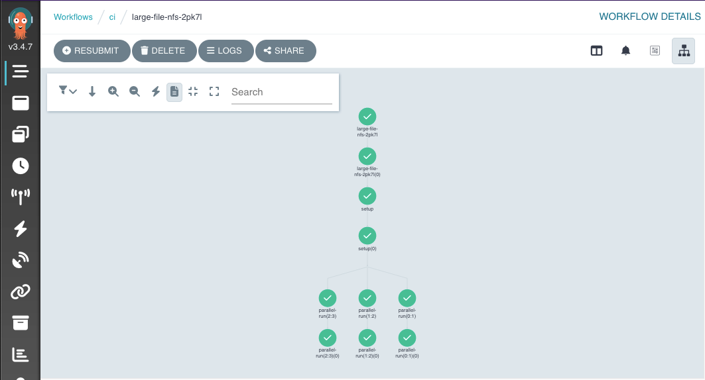
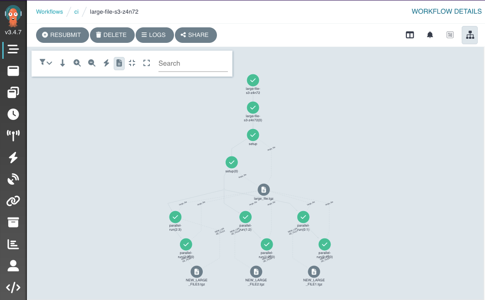

# Configuring Volumes for Parallel Workflow Reads and Writes

The tests used in the Argocon [Lightning Talk: Configuring Volumes for Parallel Workflow Reads and Writes - Lukonde Mwila, Amazon Web Services & Tim Collins, Pipekit
](https://sched.co/1Jo9v)

NFS-server-provisioner     |  S3
:-------------------------:|:-------------------------:
   |  

## Tests
The tests require:

- A configured Workflow environment with S3 configured as an artifact repository.
- nfs-server-provisioner installed in the cluster, using `nfs` as the storage class name.
  - The test requires a minimum of 40Gi of storage (either ephemeral or mounted from a persistent volume)

Tests are found in in the [tests](tests) directory of this repo.

## Workflow configuration
The workflow controller configmap configuration we used is in the [workflows-config](workflows-config) directory of this repo. However, more information on setting up an S3 artifact repository with Argo Workflows can be found in the [Argo Workflows Documentation](https://argoproj.github.io/argo-workflows/configure-artifact-repository/#configuring-aws-s3)

# Further information:

## Working example using nfs-server-provisioner
[Deploys nfs-server-provisioner using Argo CD and uses it in a simple CI workflow](https://github.com/pipekit/argo-workflows-ci-example).

You can run the whole thing locally in a k3d cluster.

## NFS-Server-Provisioner
[The repo for the nfs-server provisioner](https://github.com/kubernetes-sigs/nfs-ganesha-server-and-external-provisioner).

## Argo Workflows Support

For more information about Argo Workflows, please see the following resources:

* [The Argo Workflows Documentation](https://argoproj.github.io/argo-workflows/)
* [The Argo Workflows GitHub Repository](https://github.com/argoproj/argo-workflows/)
* [The Argo Workflows Slack Channel](https://cloud-native.slack.com/archives/C01QW9QSSSK)

---

## About Pipekit
[Pipekit](pipekit.io) allows you to manage your workflows at scale. The control plane configures Argo Workflows for you in your infrastructure, enabling you to optimize multi-cluster workloads while reducing your cloud spend.  The team at Pipekit is also happy to support you through your Argo Workflows journey via commercial support.
