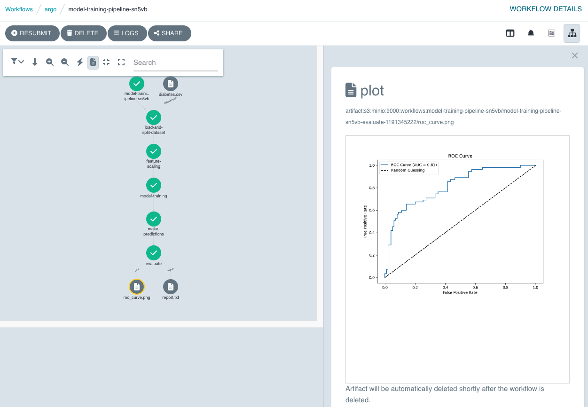

# How To Get the Most out of Hera for Data Science

> TL;DR: marry the flexibility of Python for investigative Data Science with the power and scale of Argo Workflows
> through Hera, a Python SDK for Argo Workflows.

## What's the Data Science Developer Experience like?

Python is the go-to language for Data Science, [top ranked](https://pypl.github.io/PYPL.html) for popularity in several
indices, with numerous libraries for specialized Data Science functions: `pandas`, `numpy`, and `sklearn`, to name a
few. Data Scientists often use these libraries to iterate on code in a Jupyter Notebook, but this results in functions
that are not tested beyond manual checks and visual inspections when using a library like `matplotlib`.

Once an algorithm or section of code has been tested in a Jupyter Notebook, the developer may move the function to a new
Python file to build out a library of analyses functions, keeping the Notebook just to arrange the calls to these
functions and visualize the results. When a dataset or computation gets too large and complicated for a local machine to
handle, developers will usually turn to a cloud offering. Here, they can make use of features like auto scaling and
workflow orchestration using cloud-native tools like Kubernetes and Argo Workflows, but then the setup can start to
become complex and require a dedicated DevOps (or "MLOps") team.

## Argo Workflows for Data Science

[Argo Workflows](https://argo-workflows.readthedocs.io/en/latest/) is a popular workflow orchestration tool, native to
Kubernetes, with a powerful backend for scaling your tasks through the use of DAGs (Directed Acyclic Graphs). It has
applications in Machine Learning (ML), CI/CD (Continuous Integration/Continuous Deployment), and data and batch
processing, meaning it is flexible for many use cases. In fact, in the
[2023 Argo Workflows survey](https://blog.argoproj.io/argo-workflows-events-2023-user-survey-results-82c53bc30543),
CI/CD was the most popular main use case, with over 50% of respondents selecting this as one of their main use cases,
while ML was the least popular out of the main use cases (28.8%).

We might infer that ML is a less popular use case for Argo Workflows for a few reasons, but the main one is that the
default developer experience for Python developers is not ideal. Compared to a tool like Airflow where the orchestration
logic is integrated into the business logic codebase, for basic Argo Workflows you will find yourself switching between
Python and YAML, as well as your command line for building and pushing images, and actually running the Workflows.

So, while Argo Workflows is a popular Kubernetes-native workflow orchestrator, it lacked a good Python developer
experience, which is important for applications in ML given the popularity of Python. Some users would prefer to not use
YAML or learn the intricacies of Kubernetes and Argo Workflows, so YAML becomes a barrier to entry for these users.
[Hera](https://hera.readthedocs.io/en/stable/) was initially released in late 2021 to address this limitation. Hera
allows you to focus on writing business logic, independent of your orchestration logic, but all still within Python.
This separation empowers data science teams to focus on their analyses and iteration while working with a powerful
orchestrator that can scale up their analyses, bridging the domain gap between data scientists and infrastructure
engineers by letting the scientists work in their preferred language.

## Hera for Data Science

Let's take a look at how we can use Argo Workflows with Hera for a more integrated data science developer experience.

### A Quick Intro to Hera

First, let's go over a basic Workflow in Hera:

```py
from hera.workflows import DAG, Workflow, script
from hera.shared import global_config

global_config.image = "python:3.12"

@script()
def flip():
    import random
    result = "heads" if random.randint(0, 1) == 0 else "tails"
    print(result)

@script()
def heads():
    print("it was heads")

@script()
def tails():
    print("it was tails")

with Workflow(generate_name="coinflip-", entrypoint="d") as w:
    with DAG(name="d") as s:
        f = flip()
        heads().on_other_result(f, "heads")
        tails().on_other_result(f, "tails")
```

Here we have three functions decorated with `@script` – this turns the function into a basic Script Template for Argo,
running on a `python3.12` image (set via the `global_config`). In YAML, the `flip` template looks like:

```yaml
  - name: flip
    script:
      image: python:3.12
      command:
      - python
      source: |-
        import os
        import sys
        sys.path.append(os.getcwd())
        import random
        result = 'heads' if random.randint(0, 1) == 0 else 'tails'
        print(result)
```

When using scripts like this, you cannot use code defined outside the function scope (such as imports or other
functions), because the function code is dumped inline in the YAML as Python source code. Hence, in Hera, this is known
as an "inline" script. Inline scripts can be cumbersome to maintain as they increase in length, but they are good for
initial prototyping, so we can see how they might be useful in a Jupyter Notebook for quick iterations.

The Workflow definition is written using a context manager, and neatly wraps up the configuration of your Workflow into
a single scope, separate to your business logic. Within the DAG context, we call the script functions to create Tasks,
which have special properties we can use for orchestration logic, like the `on_other_result` property. Note that within
a DAG or Steps context, the contents of your functions are not actually being run, as Hera only uses the function call
to construct the appropriate Task:

```py
f = flip()
# is equivalent to
f = Task(name="flip", template=flip)
```

### Scripts Deep Dive

We've seen how inline scripts are good for initial prototyping, but how can we avoid writing such lengthy functions,
which don't follow good Python practices of using imports outside of functions? We can use Hera's
[Script Runner feature](https://hera.readthedocs.io/en/stable/user-guides/script-basics/#runnerscriptconstructor).

The Script Runner allows you to write Script Templates using fully-native Python – you can use imports and functions
from anywhere in your codebase! However, to run your code on Argo Workflows, you will need to build an image from your
code and dependencies.

The easy part is changing your script to use the Runner, all you have to do is specify the `constructor` in the script
decorator's arguments:

```py
@script(constructor="runner")
def flip():
    import random
    result = "heads" if random.randint(0, 1) == 0 else "tails"
    print(result)
```

This results in a YAML that looks like the following:

```yaml
  - name: flip
    script:
      image: python:3.8
      command:
      - python
      args:
      - -m
      - hera.workflows.runner
      - -e
      - examples.workflows.scripts.coinflip:flip
      source: '{{inputs.parameters}}'
```

We still have a `script` template, but now we have `args` and the `source` is the input parameters.

Let's go over the
`args`: they are telling the `python` command in the `python:3.8` image to run the `hera.workflows.runner` module, which
itself takes the `-e` (or `--entrypoint`) option, which is passing the function to run in `module:function` format. The
`source` being the input parameters is a result of a quirk of Argo Workflows for script templates, where the contents of
`source` are copied into the running container as a file. In Hera, we exploit this to get the input values at runtime on
Argo.

The benefits of using runner scripts include a fully-native Python experience of using functions and imports across the
codebase, meaning you can write and test smaller functions, giving you more confidence in your Workflow. However, using
the runner means you need to rebuild the image whenever you change your script functions (but not if you just change the
Workflow code), which can result in a slower prototyping cycle, and the initial setup to get a suitable CI/CD pipeline
can be more complex. Therefore, using the Hera runner is suited for long-lived or repeatedly-executed Workflows
(such as WorkflowTemplates, CronWorkflows, or event-triggered Workflows) that you want to be sure are correct through rigorous
testing in the development phase, rather than running one-off Workflows. You should also automate the setup of the
Runner and CI/CD for new Workflows codebases to get started quickly (e.g.
[using `cookiecutter`](https://cookiecutter.readthedocs.io/en/stable/)), which can reduce the ramp-up gap of using the
Hera Runner versus inline scripts.

#### Setting up CI/CD for the Hera Runner

As a quick aside, to help you get up and running with the Hera Runner, you can start by setting Hera's
`global_config.image` to an environment variable. For example, in your Workflow code you can use:

```py
from hera.shared import global_config
import os

global_config.image = os.environ.get("IMAGE_NAME") or "ds-blog:v0"
```

Then, you could build or submit your Workflow through a Python script on the command line, e.g. for a script at `ds_blog/run_workflow.py` such as:

```py
if __name__ == "__main__":
    from ds_blog.workflow import w

    print(w.to_yaml())
```

You can run this like so:

```
IMAGE_NAME=ds-blog:v2 python -m ds_blog.run_workflow > my-workflow.yaml
```

In a CI/CD context, this means you could use something like [GitHub Actions](https://docs.github.com/en/actions) to set
the build tag to something like the current release, or current PR number, so you can build and publish an image using
this build tag, and then submit a Workflow which references the same build tag, all within CI, using an integration like
[Docker Hub](https://docs.github.com/en/actions/use-cases-and-examples/publishing-packages/publishing-docker-images).

```yaml
steps:
- uses: actions/checkout@v4
- name: Build image
  uses: docker/build-push-action
  with:
    context: .
    file: ./Dockerfile
    push: true
    tags: ${{ github.event.release.tag_name }}
- name: Set up Python
  uses: actions/setup-python@v5
  with:
    python-version: '3.x'
# ...More setup steps, then...
- name: Build and run workflow
  run: IMAGE_NAME=${{ github.event.release.tag_name }} python -m run_workflow
```

### Argo's Features for Data Science

A few of Argo's most useful features for data science include fan-out, artifact visualization and intermediate
parameters, which enable you to automatically parallelize, inspect results such as graphs, and perform human-in-the-loop
reviews and retries.

Fan-out, known as [loops](https://argo-workflows.readthedocs.io/en/latest/walk-through/loops/) in Argo, is how you can
process data in parallel - the benefits for data science are clear: splitting data sets, or running experiments with
different values, or tuning hyperparameters. It is simple to set up using the `with_items` or `with_param` variables in
Hera tasks. The [loops guide](https://hera.readthedocs.io/en/stable/walk-through/loops/) in the Hera docs explains more
about the syntax.

[Artifact visualization](https://argo-workflows.readthedocs.io/en/latest/artifact-visualization/) is offered by Argo
Workflows out of the box, where all you have to do is output uncompressed files or folders from a task or step. In the
context of data science, this would let you view full html reports, or individual graphs (as images). This combines well
with [intermediate parameters](https://argo-workflows.readthedocs.io/en/latest/intermediate-inputs/), where you could
have a Workflow to retry model training with different values.



Let's see how these features combine in a data science scenario!

## Data Science Scenario

You have been brought on as a consultant for a hospital wanting to predict diabetes diagnosis.

You've been given [the dataset](https://www.kaggle.com/datasets/uciml/pima-indians-diabetes-database) and a
proof-of-concept script to load it, split it into train, test and validation sets, and run a logistic regression to
predict the diagnosis. Let's adapt the script to run on Argo Workflows using Hera!

### Intro to the Code

The code you're given uses `pandas` to load the csv file, then `sklearn` to run the logistic regression. It does a
single, simple split of the data into train, test and validation sets. Finally, it outputs the model's accuracy and
other evaluation metrics, including an [ROC curve](https://en.wikipedia.org/wiki/Receiver_operating_characteristic).

```py
import pandas as pd
from sklearn.model_selection import train_test_split
from sklearn.preprocessing import StandardScaler
from sklearn.linear_model import LogisticRegression
from sklearn.metrics import accuracy_score, classification_report, roc_curve, roc_auc_score
import matplotlib.pyplot as plt

# Load dataset
data = pd.read_csv('diabetes.csv')

# Split into features and target
X = data.drop('Outcome', axis=1)
y = data['Outcome']

# Train-test split
X_train, X_test, y_train, y_test = train_test_split(X, y, test_size=0.2, random_state=42)

# Feature scaling
scaler = StandardScaler()
X_train = scaler.fit_transform(X_train)
X_test = scaler.transform(X_test)

# Model training
model = LogisticRegression(random_state=42)
model.fit(X_train, y_train)

# Predictions
y_pred = model.predict(X_test)

# Evaluation
accuracy = accuracy_score(y_test, y_pred)
report = classification_report(y_test, y_pred)

print(f"Accuracy: {accuracy:.2f}")
print(f"Classification Report:\n{report}")

y_prob = model.predict_proba(X_test)[:, 1]
fpr, tpr, thresholds = roc_curve(y_test, y_prob)
auc = roc_auc_score(y_test, y_prob)

plt.figure(figsize=(8, 6))
plt.plot(fpr, tpr, label=f"ROC Curve (AUC = {auc:.2f})")
plt.plot([0, 1], [0, 1], "k--", label="Random Guessing")
plt.xlabel("False Positive Rate")
plt.ylabel("True Positive Rate")
plt.title("ROC Curve")
plt.legend()
plt.show()
```

Running the code gets a matplot figure and the following on the command line:

```
Accuracy: 0.75
Classification Report:
              precision    recall  f1-score   support

           0       0.81      0.80      0.81        99
           1       0.65      0.67      0.66        55

    accuracy                           0.75       154
   macro avg       0.73      0.74      0.73       154
weighted avg       0.76      0.75      0.75       154
```

To get this working on Argo Workflows we'll need to recreate the code in functions for each part of the pipeline. We
will also need to build an image from the code with dependencies (`hera`, `pandas`, `scikit-learn` and `matplotlib`)
installed, and we'll need an S3 or other Argo-compatible cloud storage mechanism, so that Argo Workflows can
automatically fetch the data for us.

### Adding Hera Components

We should first split up the script into logical steps: fetching data, splitting it, transforming (feature scaling),
training, prediction and evaluation. Each of these can be a single task in a DAG, but we might combine fetching and
splitting for convenience. We'll use Hera's Runner scripts which means we'll need to use `docker` to build an image, but
we'll have more flexibility when defining and using inputs and outputs.

#### Create a Pipeline of Functions

First, let's update the code to use functions, and add a `__main__` section to run the "pipeline".

```py
from pathlib import Path

import pandas as pd
from sklearn.model_selection import train_test_split
from sklearn.preprocessing import StandardScaler
from sklearn.linear_model import LogisticRegression
from sklearn.metrics import accuracy_score, classification_report
from sklearn.metrics import roc_curve, roc_auc_score
import matplotlib.pyplot as plt
from numpy import ndarray


def load_and_split_dataset(
    dataset_path: Path,
) -> tuple[
    pd.DataFrame,
    pd.DataFrame,
    pd.Series,
    pd.Series,
]:
    data = pd.read_csv(dataset_path)

    X = data.drop("Outcome", axis=1)
    y = data["Outcome"]

    X_train, X_test, y_train, y_test = train_test_split(
        X, y, test_size=0.2, random_state=42
    )

    return X_train, X_test, y_train, y_test


def feature_scaling(
    X_train: pd.DataFrame, X_test: pd.DataFrame
) -> tuple[ndarray, ndarray]:
    scaler = StandardScaler()
    X_train = scaler.fit_transform(X_train)
    X_test = scaler.transform(X_test)
    return X_train, X_test


def model_training(X_train: ndarray, y_train: pd.Series) -> LogisticRegression:
    model = LogisticRegression(random_state=42)
    model.fit(X_train, y_train)
    return model


def make_predictions(model: LogisticRegression, X_test: ndarray) -> pd.DataFrame:
    y_pred = model.predict(X_test)
    return y_pred


def evaluate(
    model: LogisticRegression,
    X_test: ndarray,
    y_test: pd.Series,
    y_pred: ndarray,
) -> tuple[float, str]:
    accuracy = accuracy_score(y_test, y_pred)
    report = classification_report(y_test, y_pred)

    y_prob = model.predict_proba(X_test)[:, 1]
    fpr, tpr, _ = roc_curve(y_test, y_prob)
    auc = roc_auc_score(y_test, y_prob)

    plot_path = Path("./roc_curve.png")
    plt.figure(figsize=(8, 6))
    plt.plot(fpr, tpr, label=f"ROC Curve (AUC = {auc:.2f})")
    plt.plot([0, 1], [0, 1], "k--", label="Random Guessing")
    plt.xlabel("False Positive Rate")
    plt.ylabel("True Positive Rate")
    plt.title("ROC Curve")
    plt.legend()

    plt.savefig(plot_path)

    plt.close()

    return accuracy, report


if __name__ == "__main__":
    X_train, X_test, y_train, y_test = load_and_split_dataset("diabetes.csv")
    X_train, X_test = feature_scaling(X_train, X_test)
    model = model_training(X_train, y_train)
    y_pred = make_predictions(model, X_test)
    accuracy, report = evaluate(model, X_test, y_test, y_pred)
```

Now, we'll go over how to turn each function into an Argo Workflows template using Hera.

First, the `load_and_split_dataset` function - we want to load the dataset CSV from S3, and we can use Hera's
[Script Annotations](https://hera.readthedocs.io/en/stable/user-guides/script-annotations/) feature to automatically
copy the Artifact to the container, and set the input variable to the path of the Artifact. So, for the function inputs,
you'll want a `dataset_path` variable, with a type of `Path`, and by using `Annotated`, you can get the `S3Artifact`
from your bucket. We can use annotations for the outputs too, and use a `NoneArchiveStrategy` so that the outputs aren't
compressed. Your function signature would then look something like this:

```py
@script(constructor="runner")
def load_and_split_dataset(
    dataset_path: Annotated[
        Path,
        S3Artifact(
            name="dataset-path",
            endpoint="minio:9000",
            bucket="workflows",
            key="diabetes.csv",
            access_key_secret=m.SecretKeySelector(
                name="my-minio-cred",
                key="accesskey",
            ),
            secret_key_secret=m.SecretKeySelector(
                name="my-minio-cred",
                key="secretkey",
            ),
            insecure=True,
            loader=None,
        ),
    ],
) -> tuple[
    Annotated[str, Artifact(name="X_train", archive=NoneArchiveStrategy())],
    Annotated[str, Artifact(name="X_test", archive=NoneArchiveStrategy())],
    Annotated[str, Artifact(name="y_train", archive=NoneArchiveStrategy())],
    Annotated[str, Artifact(name="y_test", archive=NoneArchiveStrategy())],
]:
```

And the code in the function performs the same operations as the local code, but must return `json` strings for Hera to
understand how to serialize them:

```py
    data = pd.read_csv(dataset_path)

    # Split into features and target
    X = data.drop("Outcome", axis=1)
    y = data["Outcome"]

    # Train-test split
    X_train, X_test, y_train, y_test = train_test_split(
        X, y, test_size=0.2, random_state=42
    )

    return (
        X_train.to_json(),
        X_test.to_json(),
        y_train.to_json(),
        y_test.to_json(),
    )
```

Next, we have the `feature_scaling` function. For this, we'll be passing the `X_train` and `X_test` artifacts from the
`load_and_split_dataset`, which means we won't need `S3Artifact` in the `Annotated` metadata to fetch them. We can also
use an `ArtifactLoader` which is able to perform the JSON-deserialization for us. Then, holding a Python `dict`, we can
reconstruct `pandas` DataFrames using `pd.DataFrame.from_dict`. We'll be outputting the transformed training and test
sets as `numpy` arrays, serialized as lists:


```py
@script(constructor="runner")
def feature_scaling(
    X_train: Annotated[dict, Artifact(name="X_train", loader=ArtifactLoader.json)],
    X_test: Annotated[dict, Artifact(name="X_test", loader=ArtifactLoader.json)],
) -> tuple[
    Annotated[list, Artifact(name="X_train", archive=NoneArchiveStrategy())],
    Annotated[list, Artifact(name="X_test", archive=NoneArchiveStrategy())],
]:
    scaler = StandardScaler()
    X_train = scaler.fit_transform(pd.DataFrame.from_dict(X_train))
    X_test = scaler.transform(pd.DataFrame.from_dict(X_test))
    assert isinstance(X_train, ndarray), type(X_train)
    assert isinstance(X_test, ndarray), type(X_test)
    return (X_train.tolist(), X_test.tolist())
```

With our features scaled, it's time to train the model! A `LogisticRegression` object is not easily string-serializable,
so we'll make use of the built-in `pickle` module to serialize the model as bytes, and write to the output Artifact.
This is where we'll need to use Hera's
[Outputs-as-Inputs](https://hera.readthedocs.io/en/stable/user-guides/script-annotations/#input-output-function-parameters)
feature, letting us write to the path stored in the variable.

```py
@script(constructor="runner")
def model_training(
    X_train: Annotated[list, Artifact(name="X_train", loader=ArtifactLoader.json)],
    y_train: Annotated[dict, Artifact(name="y_train", loader=ArtifactLoader.json)],
    model_path: Annotated[
        Path, Artifact(name="model", archive=NoneArchiveStrategy(), output=True)
    ],
):
    X_train = np.array(X_train)
    y_train = pd.Series(y_train)
    model = LogisticRegression(random_state=42)
    model.fit(X_train, y_train)
    model_path.write_bytes(pickle.dumps(model))
```

Now, we can try making predictions on the test dataset and evaluating the model's performance. We don't need any new
knowledge to write these templates, but we still need to be mindful of deserializing inputs and serializing to outputs
correctly, and we need to provide a path with a file extension of `.png` to get the ROC curve for the Argo UI to
recognise it as an image and display it. We can also output the report as an Artifact.

```py
@script(constructor="runner")
def make_predictions(
    model_path: Annotated[Path, Artifact(name="model", loader=None)],
    X_test_list: Annotated[list, Artifact(name="X_test", loader=ArtifactLoader.json)],
) -> Annotated[list, Artifact(name="y_pred", archive=NoneArchiveStrategy())]:
    model = pickle.loads(model_path.read_bytes())
    X_test = np.array(X_test_list)
    assert isinstance(model, LogisticRegression), type(model)
    assert isinstance(X_test, np.ndarray), type(X_test)
    y_pred = model.predict(X_test)
    return y_pred.tolist()


@script(constructor="runner")
def evaluate(
    model_path: Annotated[Path, Artifact(name="model", loader=None)],
    X_test_list: Annotated[list, Artifact(name="X_test", loader=ArtifactLoader.json)],
    y_test_list: Annotated[dict, Artifact(name="y_test", loader=ArtifactLoader.json)],
    y_pred_list: Annotated[list, Artifact(name="y_pred", loader=ArtifactLoader.json)],
    plot_path: Annotated[
        Path,
        Artifact(
            name="plot",
            path="/tmp/roc_curve.png",
            output=True,
            archive=NoneArchiveStrategy(),
        ),
    ],
    report_path: Annotated[
        Path,
        Artifact(
            name="report",
            path="/tmp/report.txt",
            output=True,
            archive=NoneArchiveStrategy(),
        ),
    ],
) -> Annotated[float, Parameter(name="accuracy")]:
    model = pickle.loads(model_path.read_bytes())
    X_test = np.array(X_test_list)
    y_test = pd.Series(y_test_list)
    y_pred = np.array(y_pred_list)

    accuracy = accuracy_score(y_test, y_pred)
    report = classification_report(y_test, y_pred)
    report_path.write_text(report)

    y_prob = model.predict_proba(X_test)[:, 1]
    fpr, tpr, _ = roc_curve(y_test, y_prob)
    auc = roc_auc_score(y_test, y_prob)

    plt.figure(figsize=(8, 6))
    plt.plot(fpr, tpr, label=f"ROC Curve (AUC = {auc:.2f})")
    plt.plot([0, 1], [0, 1], "k--", label="Random Guessing")
    plt.xlabel("False Positive Rate")
    plt.ylabel("True Positive Rate")
    plt.title("ROC Curve")
    plt.legend()

    plt.savefig(str(plot_path))

    plt.close()

    return accuracy
```

#### Creating the Workflow

The hard part is over - you've got a bunch of functions doing the dataset loading and transformation, a model is trained
on it, and you can evaluate it! Now, we want to run the pipeline on Argo Workflows, by writing a `Workflow`. We can
create a `Workflow` using Hera's context manager pattern, and within that, create a DAG. Then, in the DAG context, we
call the functions that we want to run as `Tasks`, and we can pass `arguments` in the function call where we can plumb
together the outputs of one task as inputs to the next. Finally, we use the "right shift" operator (`>>`) to tell Hera
the dependencies between tasks. So, for the first two tasks, this will look like:


```py
with Workflow(generate_name="model-training-pipeline-", entrypoint="run-training") as w:
    with DAG(name="run-training"):
        datasets_task = load_and_split_dataset()
        scaling_task = feature_scaling(
            arguments=[
                datasets_task.get_artifact("X_train"),
                datasets_task.get_artifact("X_test"),
            ]
        )
        datasets_task >> scaling_task
```

With that, we can fill out the rest of the Workflow:

```py
with Workflow(generate_name="model-training-pipeline-", entrypoint="run-training") as w:
    with DAG(name="run-training"):
        datasets_task = load_and_split_dataset()
        scaling_task = feature_scaling(
            arguments=[
                datasets_task.get_artifact("X_train"),
                datasets_task.get_artifact("X_test"),
            ]
        )
        model_training_task = model_training(
            arguments=[
                scaling_task.get_artifact("X_train"),
                datasets_task.get_artifact("y_train"),
            ]
        )

        make_predictions_task = make_predictions(
            arguments=[
                model_training_task.get_artifact("model"),
                scaling_task.get_artifact("X_test"),
            ]
        )

        evaluate_task = evaluate(
            arguments=[
                model_training_task.get_artifact("model"),
                scaling_task.get_artifact("X_test"),
                datasets_task.get_artifact("y_test"),
                make_predictions_task.get_artifact("y_pred"),
            ]
        )

        (
            datasets_task
            >> scaling_task
            >> model_training_task
            >> make_predictions_task
            >> evaluate_task
        )
```

### Running on Argo

First, you'll need to build a docker image and set `global_config` values, with the image set to the `name:tag` that you
use when running `docker build`. Here, we use `docker build -t ds-blog:v1 .`, so we set the image to `ds-blog:v1`. We also
need to ensure the `script_annotation` experimental feature is turned on:

```py
global_config.image = "ds-blog:v1"
global_config.experimental_features["script_annotations"] = True
```

Then, to run the Workflow on Argo, you'll need a `namespace` and `WorkflowsService`. You may also need a "Bearer" token
– see [the Authentication guide](https://hera.readthedocs.io/en/stable/walk-through/authentication/) in Hera for more
details.

Then, you simply call `w.create()` and your Workflow will be running on Argo! Here, we have the creation under a
`__main__` context so we can run `python model_pipeline.py` to create the workflow from the command line. We are also
using a local installation of Argo Workflows, hence the `localhost` and not verifying SSL.

```py
if __name__ == "__main__":
    w.namespace = "argo"
    w.workflows_service = WorkflowsService(
        host="http://localhost:2746",
        verify_ssl=False,
    )
    w.create()
```

We can use the Argo CLI to check the Workflow status:

```
$ argo get model-training-pipeline-rprgs
Name:                model-training-pipeline-rprgs
Namespace:           argo
ServiceAccount:      argo
Status:              Succeeded
Conditions:          
 PodRunning          False
 Completed           True
Duration:            51 seconds
Progress:            5/5
ResourcesDuration:   0s*(1 cpu),26s*(100Mi memory)

STEP                              TEMPLATE                PODNAME                                                          DURATION  MESSAGE
 ✔ model-training-pipeline-rprgs  run-training                                                                                         
 ├─✔ load-and-split-dataset       load-and-split-dataset  model-training-pipeline-rprgs-load-and-split-dataset-3942071323  5s          
 ├─✔ feature-scaling              feature-scaling         model-training-pipeline-rprgs-feature-scaling-2001499791         5s          
 ├─✔ model-training               model-training          model-training-pipeline-rprgs-model-training-1186273257          5s          
 ├─✔ make-predictions             make-predictions        model-training-pipeline-rprgs-make-predictions-4049395750        5s          
 └─✔ evaluate                     evaluate                model-training-pipeline-rprgs-evaluate-1363980612                5s
```

And we can see the ROC curve directly in the Argo UI!


## Conclusion

In this blog post, we've seen how Hera can be used for Data Science scenarios, and we have a basic Workflow running on
Argo Workflows, using artifact fetching from S3 and artifact visualization in the Argo UI. The Workflow code can serve
as a base to build on, where you can add intermediate parameters for retraining with different values, more artifact
visualization, and you can also start to use other built-in features of Argo such as
[looping](https://argo-workflows.readthedocs.io/en/latest/walk-through/loops/) over parameters and
[retry strategies](https://argo-workflows.readthedocs.io/en/latest/retries/) to ensure jobs complete.
